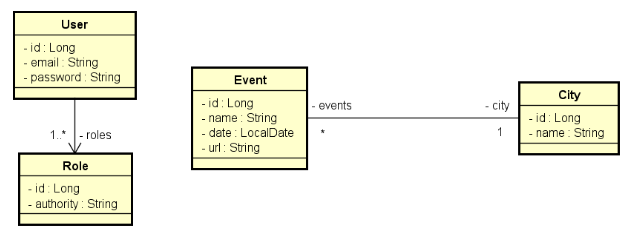
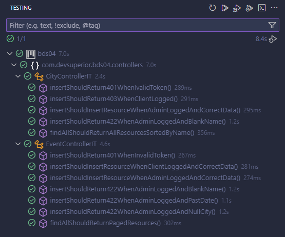

## Desafio Validação e Segurança - by _devsuperior_

 >Implemente as funcionalidades necessárias para que os testes do projeto abaixo passem (assista o vídeo explicativo e baixe o projeto no conteúdo anexo ao vídeo).

Este é um sistema de eventos e cidades com uma relação N-1 entre eles:

Regras de controle de acesso:
- Somente rotas de leitura (GET) de eventos e cidades são públicas (não requer login).
- Usuários CLIENT e/ou ADMIN podem inserir novos eventos (POST).
- Os demais acessos são permitidos apenas a usuários ADMIN.

Regras de validação de City:
- Nome não pode ser vazio

Regras de validação de Event:
- Nome não pode ser vazio
- Data não pode ser passada
- Cidade não pode ser nula

Mínimo para aprovação: ✅: 10/12

Testes concluídos Com sussesso ✅: 12/12

